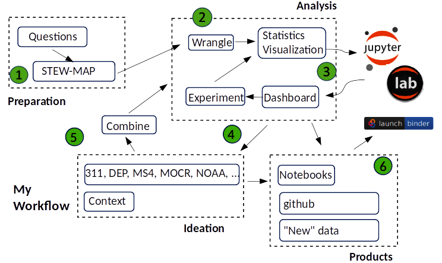

# STEW-MAP
On March 10, 2022 I attended the civic-hack-a-thon for stewardship mapping at the open-data.nyc event. The goal was to provide code, and ideas, for the STEW-MAP system built and maintained by the USDA Forest Service / Pratt SAVI.  We had a second meeting on Saturday March 12 to present our results.  This repository is a collection of notebooks, and data, continuing that initial work.

Four possible hack-a-thon projects were proposed at the kickoff:

1) STEW-MAP Live
2) Data visualization (for the social network)
3) Text analysis to improve understanding of the stewardship organizations
4) Mapping social infrastructure and climate change

This work addresses #4.  The goal is to identify, understand, and integrate, climate related open data with STEW-MAP.  How might it inform the work and organziation of stewardship groups contained in STEW-MAP?

 
# Introduction - Annotated Workflow  

Let's start with a farily generic description of the workflow and some details for each step:

 

     
 

  

 STEW-MAP data are in three files, two geodatabases and one xls.  The gdb's include points for Office Locations, and polygons for Turfs. Attribute information is the same for both.  Besides the geodata, there is a network dataset that portrays the social relationships among the stewardship organizations.

 My tools are from the python geodata stack.  I make use of pandas, geopandas, and networkx.  For mapping and visualization I use folium and ipyleaflet based packages.  As I work with the data, I use standard matplotlib like plots for dataframes and the folium-based explore method on geodataframes.

 I use jupyter lab to develop, and share, my computational notebooks.  I have a fairly standard project layout to organize notebooks, data, and reference materials published on github.

 This work started with the open-data.nyc project area for Team 4.  We're looking at finding, combining, and mapping open data for social infrasture and climate change.  The idea is to combine other sources with STEW-MAP.  For starters, I am looking at flood risk in the borough of Brooklyn.  The idea is to develop a workflow that can be used for other locations, building on the data and analytic workflow.

 We'll look at different ways to combine the data.  Using spatial extent and attribute information we can create purpose built datasets for specific problems.  With that as context, we can better understand observational data, i.e. 311 or weather, for a better understanding of what is going on.

 I like to think about possible `products` from the analytic workflow.  At a minimum, this github repo detailing the data used, how it is cleaned, and understood is one type.  At the second level, standards can be applied to reuse the knowledge gained is a key benefit.  Finally, can we combine STEW-MAP with MOCR data and analysis to implement a [plan](https://www1.nyc.gov/assets/orr/pdf/publications/Coastal-Protection-Guidance.pdf)?  These are just the inital ideas.  With some help from USDA/Pratt SAVI I'm sure we can explore others!

## Contents of the Repository

- data folder - I have raw and processed sub-folders.  These data sets can be large so github is not the way to manage them.  I will include some of the processed data for the `product` notebooks.  The raw folder will  contain notes on where to get the data from nyc sources.  I've added some details in [ENV.md](ENV.md)

- img folder - Contains images for this README

- notebooks folder - The collection of notebooks.  See the `Table of Contents` below:

 

  **01-STEW-MAP:**
  
  We'll start by looking at the STEW-MAP data.  STEW-MAP includes two geodata files, turfs, and office locations.  It also has network data, capturing the relationships among steward organizations.  Ultimately I would like to understand how they are related and `combine` them.
  
   - [01.1-explore-stew-geo.ipynb](notebooks/01.1-explore-stew-geo.ipynb) - Process the STEW-MAP geodatabases
   - [01.2-explore-stew-network.ipynb](notebooks/01.2-explore-stew-network.ipynb) - Understand the social network component of STEW-MAP

  
  **02-NYC Data:**   
  
  
  I have to say I’m impressed with the amount and quality of open data in NYC.  Currently, I’m focused on climate-related data - 311 reports for catch basins, sea-level rise, and flood models.  My process is to find and understand data sets and place them in various data/raw directories.  You can find more details on the data directory layout in [ENV.md](ENV.md)
  
   - [02.1-admin-boundaries.ipynb](notebooks/02.1-admin-boundaries.ipynb) - Boundary information from the NYC Planning Dept.
   - [02.2-311.ipynb](notebooks/02.2-311.ipynb) - Slicing and dicing the **very** large 311 dataset
   - [02.3-DEP.ipynb](notebooks/02.3-DEP.ipynb) - Data from the Department of Environmental Protection
   - [02.4-sea-level-rise.ipynb](notebooks/02.4-sea-level-rise.ipynb) - Based on inspiration from Mayors Office of Climate Resiliency 
   - [02.5-flood-map.ipynb](notebooks/02.5-flood-map.ipynb) - Another inspiration from MOCR

    
  **03-Combining Data:**
  
  This section has the code to create processed data for Brooklyn.  Of course, the idea is to make it general enough to work with other geographies and data types.  I will focus on these data sets when working on specific use cases.  Note the results in this section end up in the data/processed/brooklyn directory.
  
   - [03.1-brooklyn-turfs.ipynb](notebooks/03.1-brooklyn-turfs.ipynb) - Spatial join(ing) to get the turfs in brooklyn
   - [03.2-brooklyn-admin.ipynb](notebooks/03.2-brooklyn-admin.ipynb) - Get brooklyn polygons for census, cdta, and nta
   - [03.3-brooklyn-dep.ipynb](notebooks/03.3-brooklyn-dep.ipynb) - Similar joins for DEP (311, ms4, CSO, ...)
   - [03.4-brooklyn-mocr.ipynb](notebooks/03.4-brooklyn-mocr.ipynb) - Flood maps and SLR for brooklyn
   - [03.5-rainfall.ipynb](notebooks/03.5-rainfall.ipynb) - NOAA daily precipitation report (2021) from the Brooklyn weather center
   - [03.6-data-fusion.ipynb](notebooks/03.6-data-fusion.ipynb) - Put it all (well most of it) together
   
  **04-Use Cases:**
  
  Our research question is, can we relate the social infrastructure in the STEW-MAP turfs with areas of climate risk using existing open data.  The previous sections highlight the workflow to create a purpose-built data set for Brooklyn in 2021 to answer this question.  This section uses this data to develop examples.

  
   - [04.1-brooklyn-story.ipynb](notebooks/04.1-brooklyn-story.ipynb) - Looking at Brooklyn in 2021 (it was a wet year)
   - [04.2-Coastal-Flood-Protection.ipynb](notebooks/04.2-Coastal-Flood-Protection.ipynb) - Implementing a strategy document from MOCR
   - [04.3-KG.ipynb](notebooks/04.3-KG.ipynb) - Data-to-knowledge

   
  **05-hacks:**
  
  Think of this section as a potpourri of hacks and idioms used in other notebooks.  I use this approach to test (and better understand) some of the code I’m developing.  My disorganized organization?
  
   - [05.1-poly-analysis.ipynb](notebooks/05.1-poly-analysis.ipynb) - Curious about the geometries (polygons) in the data
   - [05.2-stew-attr.ipynb](notebooks/05.2-stew-attr.ipynb) - This is an old one with some initial analysis of the attributes
   - [05.3-other-sources.ipynb](notebooks/05.3-other-sources.ipynb) - A placeholder to identify other sources of information about Brooklyn
   - [05.4-ts.ipynb](notebooks/05.4-ts.ipynb) - Time series hacking for the calendar heatmap
   - [05.5-clustering.ipynb](notebooks/05.5-clustering.ipynb) - Hacks to cluster data, also includes the elevation hack
   - [05.6-animated-heatmap.ipynb](notebooks/05.6-animated-heatmap.ipynb) - Want to include the folium animated heatmap for 311
   - [05.7-turfs-and-counts.ipynb](notebooks/05.7-turfs-and-counts.ipynb) - Used to add information to the display/overlays
   - [05.8-network-based-clusters.ipynb](notebooks/05.8-network-based-clusters.ipynb) - Place holder for network based clustering of point features.  Based on Geoff Boeing's work.
   - [05.9-turfs-sn.ipynb](notebooks/05.9-turfs-sn.ipynb) - Linking alters to turfs for first demo.
   
   
 Reference material on the environment and data organization can be found in [ENV.md](ENV.md)
   